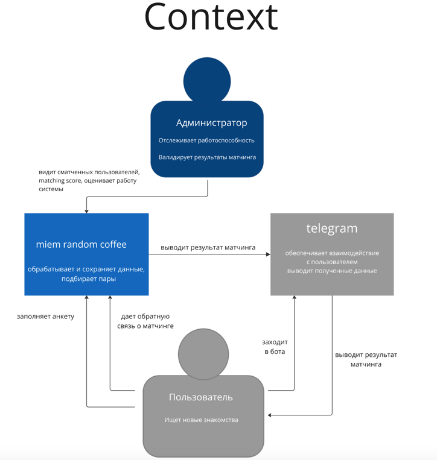
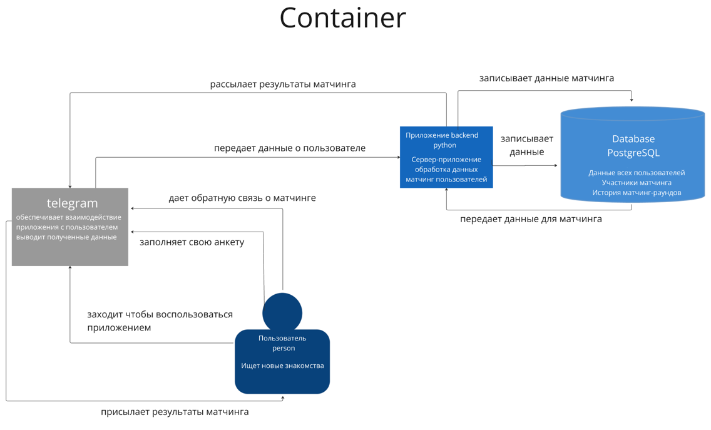
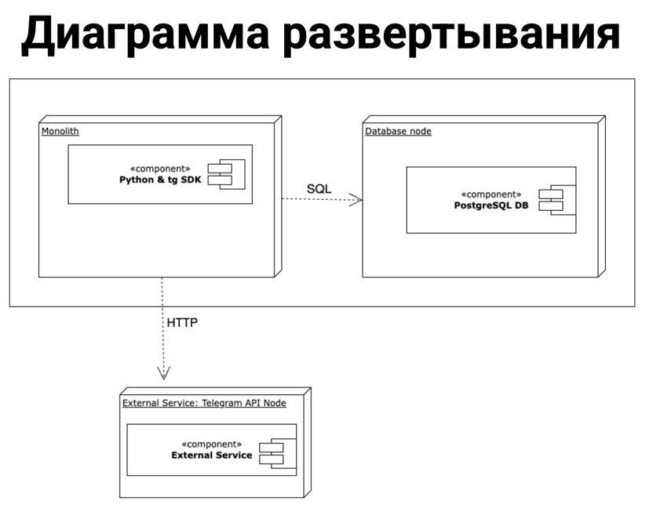

# Документация разработчика

## Технические требования
Минимальные требования к техническому оборудованию:

    ПК:
    Процессор — Intel или AMD, 1,5 ГГц или выше
    Оперативная память не менее 1гб
    Свободная память компьютера – не менее 7 Гб

ПО:

    Docker Engine

## Архитектура

### Диаграмма C4 - context


### Диаграмма C4 - context


### Диаграмма развертывания


## Функционал


- **Регистрация пользователя**

    Пользователь может заполнить свою анкету, выбирая из выпадающего списка откликающиеся интересы. Пользователь может добавить фотографию

- **Участие в матчинге**

    Пользователь может стать участником random coffee. Приложение будет искать ему подходящего собеседника

- **Обратная связь**

    Пользователь может дать обратную связь по матчингу: насколько ему понравился собеседник, каких собеседников он хочет видеть в будущем


## Содержание репозитория
- main.py - модуль, отвечающий за обработку комманд и callback data, а также запуск бота
- matching.py - модуль, содержащий функции матчинга пользователей
- messages.py - содержит функции, формирующие сообщения для пользователя
- processing_functions.py - модуль, содержащий функции взаимодействия с данными, рассылок сообщений
- admin_functions.py - модуль, содержащий функции для меню администратора
- statistic_functions.py - модуль, отвечающий за сбор статистик из БД


Дополнительные файлы:
- photos - директория с хранящимися пользовательскими фотографиями
- dockerfile - файл для создания билда
- requirements.txt - список необходимых библиотек

Файлы-примеры:

    Эти файлы уже содержат данные реальных пользователей чтобы вы могли запустить матчинг без создания дополнительных аккаунтов. Если вы их удалите, будут созданы новые файлы при добавлении пользователей

- participants.csv - файл, содержащий участвующих пользователей
- matching_rate.csv - файл с оценками матчинга от пользователей
- matches.csv - файл с информацией о всех результатах матчинга
- all_users.csv - файл с информацией о всех пользователях, пользовавшихся ботом
- admins.csv - файл с юзернеймами администраторов
- all_matchings.csv - файл с попарным матчингом
- matching_log.csv - файл со статистикой по каждому матчингу, в т.ч веса тегов, кол-во участников и тд
- profiles_updates.csv - профили для модерации, которые были изменены или добавлены
- registration_log.csv - лог регистрации пользователей с датой и временем

## Установка
- Склонируйте репозиторий
- Установите Docker engine или Docker desktop
- Создайте билд контейнера

    - Запустите докер.
    - Откройте директорию проекта через терминал
    - Запустите билд контейнера через команду `docker build -t <container_name:version> ./`
- Запустите контейнер
    - Командой `docker images` узнайте image id созданного образа
    - `docker run <image id>`
- Откройте .env.example

  Ваш файл будет выглядеть следующим образом:
  ```
  BOT_TOKEN=TOKEN
  TG_ADMIN_USERNAME=USERNAME
  ```
  В BOT_TOKEN надо добавить токен телеграм бота, который вы можете получить у @BotFather (см. тут)
  
  TG_ADMIN_USERNAME добавьте свой username для получения прав администратора и доступа к функциям администратора
#

## Пользовательские сценарии

### Пользователь

- Заполнить профиль
- Включить участие в матчинге
- Получить собеседника в метче
- Оставить обратную связь о метче


### Администратор

- Управление списком администраторов
  - Добавить администратора
  - Удалить администратора
- Модерация анкет пользователей
  - Одобрить анкету
  - Заблокировать пользователя
- Просмотр матчингов
  - Попарная статистика - подобранные пользователи и их обратная связь
  - Все матчинги в виде csv таблицы
- Просмотр статистики
  - По новым пользователям
  - По всем пользователям
  - По матчингам - веса тегов, количество участников, время и номер матчинга
